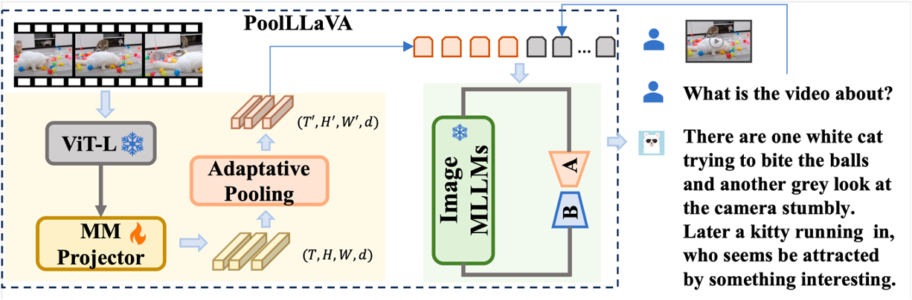
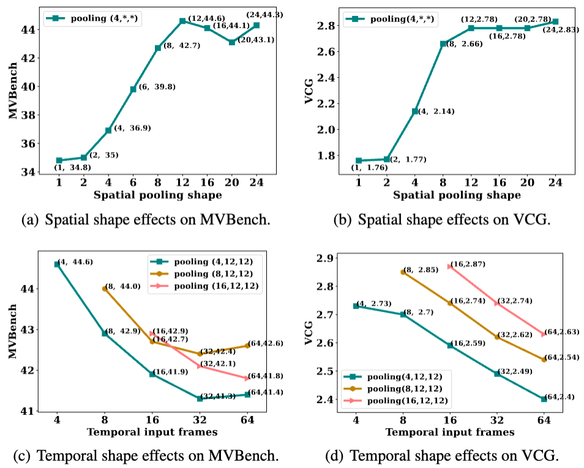
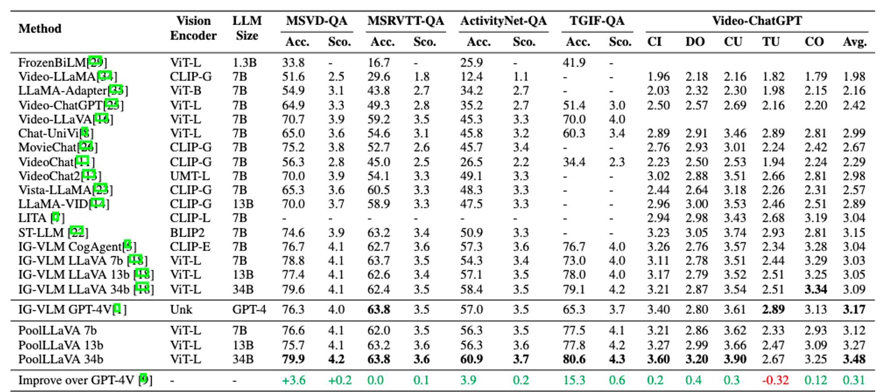

<div align="center">

<h2><a href="https://arxiv.org/abs/2311.17005">PLLaVA : Parameter-free LLaVA Extension from Images to Videos for Video Dense Captioning</a></h2>

[Lin Xu](https://scholar.google.com/citations?user=_Gu69coAAAAJ), [Yilin Zhao](https://ermu2001.github.io/me.io/), [Daquan Zhou](https://scholar.google.com/citations?user=DdCAbWwAAAAJ), [Zhijie Lin](https://scholar.google.com/citations?user=xXMj6_EAAAAJ), [See-Kiong Ng](https://scholar.google.com/citations?user=_wsommYAAAAJ), [Jiashi Feng](https://scholar.google.com.sg/citations?user=Q8iay0gAAAAJ&hl=en)
</div>

[](https://arxiv.org/abs/2311.17005)
[]()
[](https://huggingface.co/spaces)
[](https://huggingface.co/ermu2001/pllava-34b)

[](https://paperswithcode.com/sota/video-based-generative-performance-1?p=pllava-parameter-free-llava-extension-from)


## Overview
Welcome to PLLAVA!

The primary purpose of this repository is to support research and the development of prototype models. It is designed to facilitate ease of experimentation and enable a clear overview of results. Please note that this section is currently undergoing development and reconstruction.

It's important to mention that we have not optimized the response speed of the application or the frontend logic. Our goal is to maintain simplicity, clarity, and ease of development, making it accessible for both researchers and students. If you have suggestions or want to enhance the application's performance, please feel free to contact us or contribute to the project.


We've briefly introduce our work in section [PLLAVA](#%EF%B8%8F-pllava). For more details, feel free to read our paper. Checkout section [Usage](#hammer-usage) to start using this repo. If you felt our works interesting, please star us, your support is all we want. If you find our work helpful, feel free to [cite](#page_facing_up-citation) us directly.

## :fire: Updates
- **2024/4/24**: Release:
    - We are releasing our code/models/datasets.

## 🏖️ PLLAVA
### Abstract
Vision-language pre-training (VLP) has significantly elevated performance across a range of vision-language applications. Yet, the pre-training process for video-related tasks demands an exceptionally high degree of computational and data resources. This paper investigates a straightforward, highly efficient, and resource-light approach to adapting an existing image-language pre-training model for video data. Our preliminary experiments reveal that directly fine-tuning pre-trained image-language models with multiple frames on video datasets leads to performance saturation or even a drop in caption-related tasks. Besides, it is also vulnerable to prompts and tends to provide short descriptions. We conducted a deep analysis and observed that the performance saturation and the vulnerability might be related to the dominant patches that exist in some single video patches. We then propose a simple pooling strategy to smooth the feature distribution along the temporal dimension and thus reduce the dominant impacts from some extreme tokens. The new model is termed Pooling LLaVA, or PLLaVA in short. With the proposed pooling strategy, we achieve new state-of-the-art performance on all evaluated datasets. Notably, on the recent popular Video ChatGPT benchmark, PLLaVA achieves a score of 3.48 out of 5 on average of five evaluated dimensions, which is the new state-of-the-art score on the leaderboard and is 0.31 higher than the previous SOTA results from GPT4V (IG-VLM). On the latest multi-choice benchmark MVBench, PLLaVA achieves 58.1% accuracy on average across 20 sub-tasks, which is the new state-of-the-art result and is 14.5% higher than GPT4V (IG-VLM).

### SEARCHING FOR OPTILAL POOLING STRATEGY
There are two dimensions for the pooling strategy: spatial dimension and the temporal dimension. We emperically found that reducing the spatial dimension with larger temporal dimension could lead to better model perfromance, compared to reducing the temporal dimension directly.



### STATE-OF-THE-ART PERFORMANCE
We compare the performance of PLLAVA with recent popular methods over both question-qnswer and captioning datasets. The results are shown below.



## :hammer: Usage
This section provides guidance on how to run, train, and evaluate our models.


### Install
First you will need to set up the environment, and download some pretrained weights. 

This repo is built up using [transformers](https://github.com/huggingface/transformers) for model construction along with [accelerate](https://github.com/huggingface/transformers) for distributed training. Follow the instruction to install the needed environment.

0. Above all, the following environment set up is for python 3.10. If you choose to use conda for environment set up, we recommand creating the virtual environment with:
```bash
conda create -n pllava python=3.10
``` 

1. Firstly, install [pytorch](https://pytorch.org/) from the official website. The code runs on torch 2.2.1, cu118 or cu122. Select the version that suits your drive version.
```
torch                       2.2.1+cu118
torchaudio                  2.2.1+cu118
torchvision                 0.17.1+cu118
```

If your driver version higher than cu121, you could probably try installing with the follow scripts:
```bash
pip install -r requirements.txt
```

Otherwise, you would need to install torch for your server first, then install the other packages:
```bash
pip install -r requirements.torch.txt # decide your own requirements, (this is for cu11), or install torch directly following the official website.
pip install -r requirements.no_torch.txt # install the following
```

2. Prepare the model.
We prefer to have huggingface models explicitly download to a MODELS directory. However, if you are familiar with huggingface-hub usage, feel free to organize the model yourself.
```
python python_scripts/hf.py
```
The model directory should look like this, where you would only need the corresponding model's weights and directory.
```
$ tree MODELS
MODELS
|-- pllava-13b
|   |-- added_tokens.json
|   |-- config.json
|   |-- generation_config.json
|   |-- model-00001-of-00006.safetensors
|   |-- model-00002-of-00006.safetensors
|   |-- model-00003-of-00006.safetensors
|   |-- model-00004-of-00006.safetensors
|   |-- model-00005-of-00006.safetensors
|   |-- model-00006-of-00006.safetensors
|   |-- model.safetensors.index.json
|   |-- preprocessor_config.json
|   |-- processor_config.json
|   |-- special_tokens_map.json
|   |-- tokenizer.json
|   |-- tokenizer.model
|   `-- tokenizer_config.json
|-- pllava-34b
|   |-- added_tokens.json
|   |-- config.json
|   |-- generation_config.json
|   |-- model-00001-of-00015.safetensors
|   |-- model-00002-of-00015.safetensors
|   |-- model-00003-of-00015.safetensors
|   |-- model-00004-of-00015.safetensors
|   |-- model-00005-of-00015.safetensors
|   |-- model-00006-of-00015.safetensors
|   |-- model-00007-of-00015.safetensors
|   |-- model-00008-of-00015.safetensors
|   |-- model-00009-of-00015.safetensors
|   |-- model-00010-of-00015.safetensors
|   |-- model-00011-of-00015.safetensors
|   |-- model-00012-of-00015.safetensors
|   |-- model-00013-of-00015.safetensors
|   |-- model-00014-of-00015.safetensors
|   |-- model-00015-of-00015.safetensors
|   |-- model.safetensors-deprecated
|   |-- model.safetensors.index.json
|   |-- preprocessor_config.json
|   |-- processor_config.json
|   |-- special_tokens_map.json
|   |-- tokenizer.json
|   |-- tokenizer.model
|   `-- tokenizer_config.json
|-- pllava-7b
    |-- added_tokens.json
    |-- config.json
    |-- generation_config.json
    |-- model-00001-of-00003.safetensors
    |-- model-00002-of-00003.safetensors
    |-- model-00003-of-00003.safetensors
    |-- model.safetensors.index.json
    |-- preprocessor_config.json
    |-- processor_config.json
    |-- special_tokens_map.json
    |-- tokenizer.json
    |-- tokenizer.model
    `-- tokenizer_config.json
```
With the above steps, you should be able to proceed on with the following usages.

### Run Application
To run our models, make sure you have downloaded a model pretrained weights from the huggingface spaces. Then, run the following scripts with the corresponding path input. Since we are only training with lora and the projector, the model to be run are determined with:
- **model_dir**: model directory, one with config.json as compatible with transformers. This refers to the base model's directory, for example "llava-hf/llava-v1.6-vicuna-7b-hf"/"ermu2001/pllava-7b"/"MODELS/pllava-7b". (default to: MODELS/plave-7b)

- **weights_dir**: your weights directory. could be the same as model_dir, but if you have a weights directory for the lora weights, you should set this weights_dir to that directory to load the lora weights. This directory should be local. Also, it would need to contain a config.json file within. (default to: ${model_dir}).

```bash
model_dir="model directory"
weights_dir="weights directory"
bash scripts/demo.sh ${model_dir} ${weights_dir}
```

Now checkout the application demo and try play with PLLAVA!

### Train
Follow the following steps to reproduce our results or train your own variant:

#### 1. Data Preparation
TODO: 
To train our model from a starting Image-aligned Vision LLM, you would need to download the data first. Our data set up is mainly based on the original Videochat2's training data. Checkout [Instruction Data](./DATA.md) to prepare the instruction training data. Eventually, you should have a folder organized as following:
```TODO:
(magic_py310) (base) xulin@9f0c9285c368:~/yilin/magic_video$ ls -l DATAS/TRAIN_TEST
total 20
-rw-r--r--  1 xulin users  123 Jan 31 15:57 DATA.md
-rw-r--r--  1 xulin users 2688 Jan 31 15:56 how_to_use.py
drwxr-xr-x 11 xulin users 4096 Jan 31 15:50 images
drwxr-xr-x  4 xulin users 4096 Jan 31 15:53 magic_jsons
drwxr-xr-x 12 xulin users 4096 Jan 30 17:00 videos
```

#### 2. Start Training
Now you're only a few step away from starting the training. Follow the instructions:

##### Setup Accelerator
Customize a accelerate training config. For example, a simple config using multiple gpus with no distribution strategy (only torch DDP) would look like:
```yaml
compute_environment: LOCAL_MACHINE
debug: false
distributed_type: MULTI_GPU
downcast_bf16: 'no'
gpu_ids: all
machine_rank: 0
main_training_function: main
mixed_precision: bf16
num_machines: 1
num_processes: 8
rdzv_backend: static
same_network: true
tpu_env: []
tpu_use_cluster: false
tpu_use_sudo: false
use_cpu: false
``` 
Checkout out the [Accelerate](https://huggingface.co/docs/accelerate/index) documents for more details.

##### Overwatch the training configuration
Next, you should go over a basic training configuration of the training process in [here](tasks/train/config_magic_nframe.py). Then passing this file as the first arg to the training script would utilize every arguments in the file. You can customize some of the hyper parameters for your own training process by passing them in the format of "key" "value" pair in the following arguments. A example training scripts could be find [here](scripts/train_pllava.sh). 

The code of configuration is mostly based on the original [Videochat2](https://github.com/OpenGVLab/Ask-Anything/tree/main/video_chat2) codebase. Salute to those fantastic researchers & engineers. Checkout the used [configuration](tasks/train/config_pllava_nframe.py) to set up a customized training!

With the above steps, you would be able to start the training process. The output would be well organized in the output directory, each a qualified model directory to pass in to demo as weights_dir, since we are only saveing the lora weights and projector weights to avoide redundancy.

### Evaluation
This section mainly introduce how to reproduce the evaluation or evaluate your own model.

#### Set up Evaluation Data
Make sure you set up the "DATAS" directory as in [DATAS.md](DATAS.md), then you would be able to run the inference with fortune! The evaluation data directory of DATAS would look like: 
```
DATAS/:
DATAS/VideoQA:
DATAS/VideoQA/TGIF_QA:
                     test_a.json
                     test_q.json
DATAS/VideoQA/TGIF_QA/videos:
                            tumblr_m4387mGrlc1r6m5e8o1_250.gif
                            ...
DATAS/VideoQA/TGIF_QA/videos_mp4:
                                tumblr_m4387mGrlc1r6m5e8o1_250.mp4
                                ...
DATAS/VideoQA/TGIF_QA/video_gif:
                               tumblr_m4387mGrlc1r6m5e8o1_250.gif
                               ...
DATAS/VideoQA/MSVD_Zero_Shot_QA:
                               test_a.json
                               test_q.json
DATAS/VideoQA/MSVD_Zero_Shot_QA/videos:
                                      -4wsuPCjDBc_5_15.avi
DATAS/VideoQA/MSVD_Zero_Shot_QA/msvd_qa:
DATAS/VideoQA/ActivityNet:
                         test_a.json
                         test_q.json
DATAS/VideoQA/ActivityNet/all_test:
                                  v_--tFD65KaK4.mp4
                                  ...
DATAS/VideoQA/MSRVTT_Zero_Shot_QA:
                                 test_a.json
                                 test_q.json
DATAS/VideoQA/MSRVTT_Zero_Shot_QA/videos:
DATAS/VideoQA/MSRVTT_Zero_Shot_QA/videos/all:
                                            video0.mp4
                                            ...

DATAS/MVBench:
             ...

DATAS/Recaption/Inter4K:
                       annotations.json
DATAS/Recaption/Inter4K/60fps:
DATAS/Recaption/Inter4K/60fps/UHD:
                                 1.mp4
                                 ...

```

#### Start Evaluate
Once you have construted the evaluation data, you can start the evaluation as in [here](scripts/eval.sh) TODO: eval 34b
```
bash scripts/eval.sh
```
Same as running the demo, you would need to determine the model_dir and weights_dir to evaluate the model. Feel free to comment out some commands and produce partial evaluation. 

#### Overwatch the Results
The evaluation results would be shown to you with our results gallery demo:
```bash
bash scripts/gallery.sh 
```

Feel free to use the compare version to compare differnt models' results or use the single gallery version to checkout one model's results. They are basically the same. Checkout the [script](scripts/gallery.sh) for more details

# :page_facing_up: Citation

If you find this project useful in your research, please consider cite:
```BibTeX

```

# :dizzy: Acknowledgement
This code base is mainly built upon [Videochat2](https://github.com/OpenGVLab/Ask-Anything/tree/main/video_chat2). SALUTE.

We would also like to recognize and commend the following open source projects, thank you for your great contribution to the open source community:

- [LLaVA](https://github.com/haotian-liu/LLaVA): Fantastic Open Source Vision LLM Model. 
- [VideoChatGPT](https://github.com/mbzuai-oryx/Video-ChatGPT/tree/main): Great Evaluation Benchmarking Framework.
- [VideoLlava](https://github.com/PKU-YuanGroup/Video-LLaVA/tree/main/videollava)
